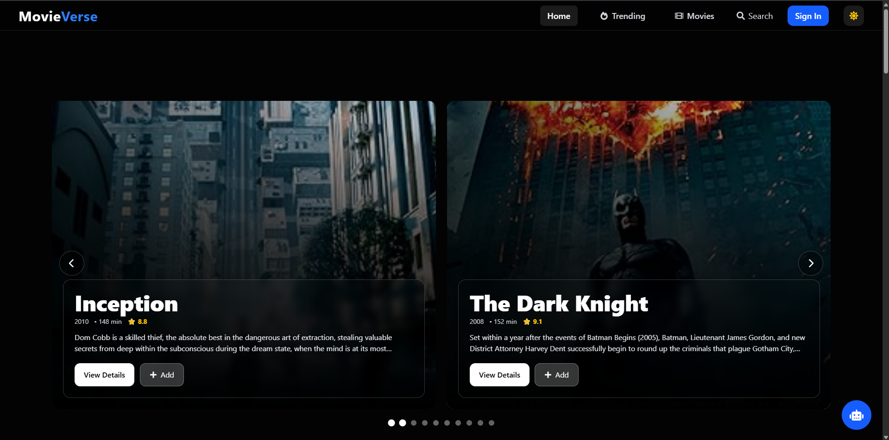
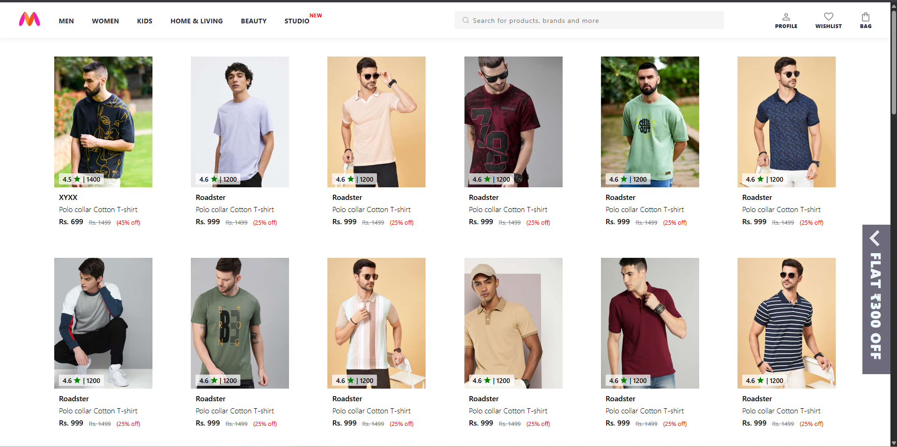
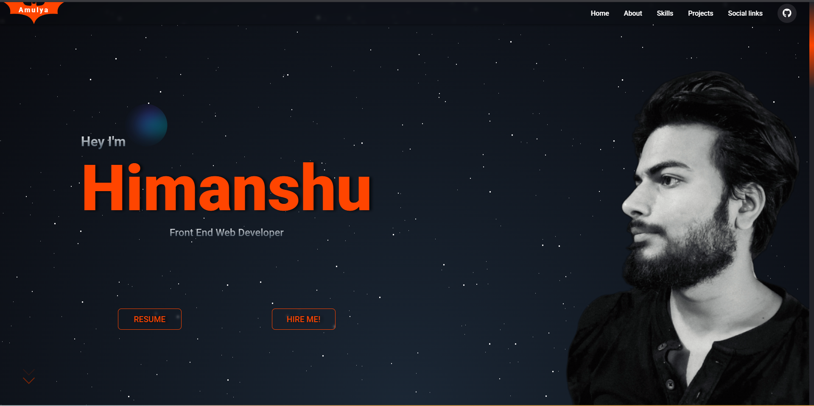

<h1>Hi, I'm Himanshu 👋</h1>
<h3>MERN Stack Developer | MCA Graduate | Full-Stack Engineer</h3>

---

## 🚀 About Me

MCA graduate and MERN Stack Developer with hands-on experience building and deploying full-stack web applications using React, Node.js, Express.js, and MongoDB. Skilled in responsive UI development, REST API design, JWT-based authentication, role-based access control (RBAC), and scalable database schema design. Seeking an entry-level software engineering role to drive real-world product impact while deepening expertise in system design, backend architecture, and performance optimisation.

---

## 🎓 Education

**Master of Computer Application (M.C.A)**  
Ranchi University (2021 – 2023)  
CGPA: 8.19 / 10

**Bachelor of Computer Application (B.C.A)**  
Ranchi University (2018 – 2021)  
CGPA: 8.6 / 10

---

## 🛠️ Tech Stack

**Languages:** JavaScript (ES6+), C, C++

**Frontend:** React.js (Hooks, Context API, Redux Toolkit), Next.js (SSR, SSG, Routing), HTML5, CSS3, Tailwind CSS, Responsive Design

**Backend:** Node.js, Express.js – REST API Design, Middleware, Centralised Error Handling, Protected Routing, MVC Architecture, WebSockets

**Databases:** MongoDB, MySQL, MongoDB Atlas, Mongoose ODM, Schema Design, Aggregations, Indexing

**Auth & Security:** JWT Authentication, Role-Based Access Control (RBAC), Protected Routes, Token Persistence

**Tools:** Git, GitHub, Linux (CLI), Vercel, Render, Netlify, Postman, VS Code

---

## 💼 Experience

**Full Stack Web Developer Intern**  
REGex Software Services, Jaipur **(Mar 2025 – Present)**

- Delivered 5+ production-ready responsive UIs with React and Tailwind CSS, reducing UI turnaround time ~30% through reusable, composable component patterns.
- Built and consumed structured RESTful APIs with Node.js and Express.js, enabling seamless client-server integration across all application modules.
- Designed scalable backend services with MongoDB schemas, JWT authentication, and protected API routing deployed in a Linux production environment.
- Followed clean-code practices, Git branching workflows, and peer code reviews; delivered features end-to-end — schema → API → React → deployment.

---

## 📌 Featured Projects

### 🎓 LMSPRO – MERN Learning Management System | [Visit](https://lmspro.example.com)

> Production-ready LMS with role-based access control — the most architecturally complex project in the portfolio.

- Role-based access control (Admin, Student, Tutor, Employee) with JWT-secured API routes and persistent token storage
- 6+ scalable modules: student management, course handling, attendance tracking, timetable scheduling, visitor records, and billing — each with pagination, filtering, and sorting
- Protected client-side routing, modular backend architecture, and responsive multi-role dashboards
- Optimised MongoDB schemas for multi-role operational workflows across all user types
- **Stack:** MongoDB · Express.js · React.js · Node.js · Mongoose · bcrypt.js · Nodemailer · JWT · Axios · Tailwind CSS

---

### 🍽️ Restaurant Management System (RMS) | [Live Demo](https://rms.example.com)

> Full-stack operations platform managing orders, menu, billing, tables, and staff end-to-end.

- Real-time UI state updates, dynamic order lifecycle handling, and modular MongoDB schemas backed by RESTful services
- Deployed on Vercel with CI pipeline; zero-downtime releases and responsive dashboard UX across all roles
- **Stack:** MongoDB · Express.js · React.js · Node.js · Mongoose · bcrypt.js · Nodemailer · JWT · Axios · Tailwind CSS

---

### 🎬 MovieVerse – Movie Browsing Platform | [Live Demo](https://movie-site-frontend-vn43.onrender.com/)

> Full-stack movie browsing platform with dynamic rendering and clean UI.

- React SPA with category browsing, lazy-loaded routes, memoised components, and search-ready UI — reducing initial bundle size ~25%
- Integrated custom REST APIs for dynamic movie data; structured codebase for extensibility across genres, filters, and new features
- **Stack:** React.js · Node.js · Express.js · MongoDB · Tailwind CSS

---

### ✅ Advanced TODO App – Full Stack Task Manager | [Live Demo](https://todo.example.com)

> Full-stack CRUD task manager with JWT authentication and stateful session management.

- Protected routes and LocalStorage token persistence for seamless session management
- REST APIs with Node.js + Express.js; data persisted to MongoDB Atlas via Mongoose; independently deployed both frontend and backend on Render
- **Stack:** React.js · Tailwind CSS · Node.js · Express.js · MongoDB Atlas · Mongoose · JWT · Axios

---

### 🛍️ Myntra Clone | [Live Demo](https://ryzenhim.github.io/myntra-clone/)

> Frontend clone emphasising layout accuracy and responsiveness.

- Pixel-accurate UI replication with reusable components and styling consistency
- **Stack:** HTML5 · CSS3 · JavaScript

---

### 🌐 Portfolio | [Visit](https://ryzenhim.github.io/mY-portfolio/)

> Personal portfolio with smooth scroll animations, project showcase, and contact section.

- Fully responsive design using HTML5, CSS3, and Vanilla JavaScript; hosted on GitHub Pages
- **Stack:** HTML5 · CSS3 · JavaScript

---

## 📜 Certifications

**Web Development Completion Certificate**  
Emancipation Edutech Private Limited (Jan 2024 – Mar 2024)  
Certificate No.: EEPL/OJT/2024/001

---

## 🏆 GitHub Trophies

---

## 📈 GitHub Activity Graph

---

## 📊 GitHub Stats

---

## 🤝 Connect With Me

---

## 🎯 Career Objective

To contribute to real-world products as a Full-Stack Developer while continuously improving code quality, system performance, and software architecture skills.

---

